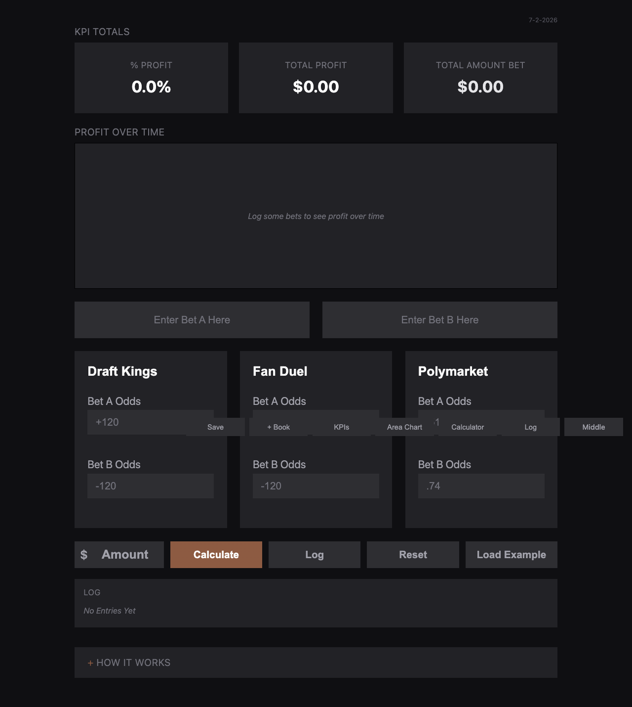
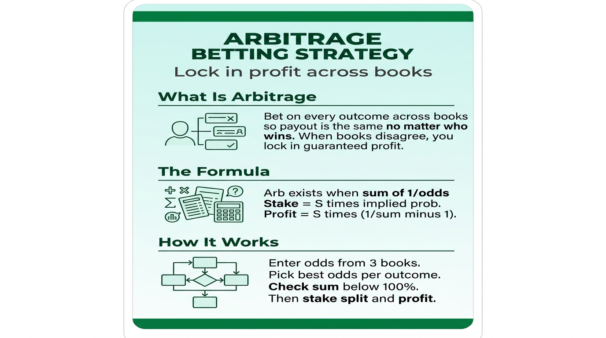

# Polymarket Arbitrage Calculator

## Live demo

**[Open the live calculator](https://stephencox1026.github.io/polymarket-arbitrage/)** — enter odds across books and see arbitrage/EV in real time.

## Strategy overview

> **Quantitative arbitrage tool** that detects cross-market pricing inefficiencies and computes expected return — transferable to pricing optimization and margin analysis.

A browser-based calculator for prediction-market (Polymarket) arbitrage: enter market prices across outcomes/venues, and it surfaces guaranteed/positive-expected-value spreads and sizing, with a bet log for tracking P&L.

## What it demonstrates
- Probability and odds math (implied probability, edge, expected value)
- Identifying and sizing risk-adjusted opportunities
- A clean, self-contained analytical tool (no backend required)

## Files
- `index.html` / `app.js` / `styles.css` — the calculator UI and logic
- `poly-odds.html`, `strategy2.html`, `strategy2.js` — strategy views
- `bet-log.csv` — position/P&L log
- `arb-strategy-infographic.png` — strategy overview

## Use
Open `index.html` in a browser, enter market prices, and review the computed arbitrage/EV output.
